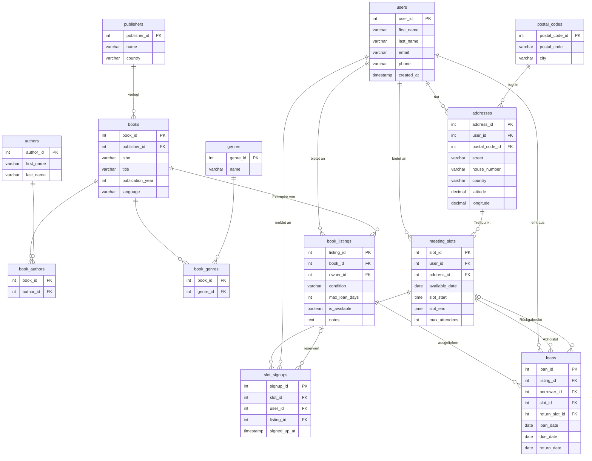

# Buchtausch-App – Datenbankprojekt
### Portfoliokurs DLBDSPBDM01_D | IU Internationale Hochschule

Eine relationale PostgreSQL-Datenbank für eine App, die das Ausleihen und Zurückgeben von Büchern in einer lokalen Gemeinschaft ermöglicht.

---

## Projektstruktur

```
Book Data-Mart/
├── 01_Konzeptionsphase/
│   └── anforderungsspezifikation.md    # Anforderungsanalyse + Datenwörterbuch
│
├── 02_Erarbeitungs-Reflexionsphase/
│   ├── buchtausch_app.sql              # Datenbankschema + Testdaten
│   ├── walkthrough.sql                 # 11-schrittiges Interaktionsbeispiel
│   └── queries.sql                     # Abfrage und Eingabe Vorlagen (21 Vorlagen)
│
├── 03_Finalisierungsphase/
│   ├── finalisierung.md                # Abschlussdokumentation
│   └── abstract.md                     # Abstract
│
├── SETUP.md                            # Installationsanleitung
└── README.md
```

---

## Datenbankschema (13 Tabellen)

| # | Tabelle | Beschreibung |
|---|---|---|
| 1 | `users` | Registrierte Benutzende |
| 2 | `postal_codes` | PLZ-Stadt-Zuordnung (3NF-Auslagerung) |
| 3 | `addresses` | Adressen der Benutzenden (inkl. GPS-Koordinaten) |
| 4 | `publishers` | Verlage der Bücher |
| 5 | `authors` | Autoren |
| 6 | `genres` | Buchgenres |
| 7 | `books` | Buchmetadaten (Katalog) |
| 8 | `book_authors` | M:N Bücher ↔ Autoren |
| 9 | `book_genres` | M:N Bücher ↔ Genres |
| 10 | `book_listings` | Konkretes Exemplar zum Verleih |
| 11 | `meeting_slots` | Zeitfenster für Buch-Übergaben (Abholung + Rückgabe) |
| 12 | `slot_signups` | M:N Anmeldungen zu Zeitfenstern (mit optionaler Buchreservierung) |
| 13 | `loans` | Ausleihtransaktionen |

---

## Dreifachbeziehungen

1. **Reservierung**: `users` x `meeting_slots` x `book_listings` -> Tabelle `slot_signups`
2. **Ausleihe**: `users` x `book_listings` x `meeting_slots` -> Tabelle `loans`

---

## Installation

In Setup.md finden sich detaillierte Anleitungen für die Einrichtung der Datenbank mit PostgreSQL, sowohl über die Kommandozeile als auch mit pgAdmin 4.

---

## Inhalt der SQL-Dateien

### `buchtausch_app.sql`
- DDL: `CREATE TABLE` für alle 13 Tabellen mit Constraints, Indizes und Fremdschlüsseln
- DML: Testdaten mit 12 Nutzern, 12 Büchern (darunter 4 Manga in verschiedenen Sprachen), 10 Verlagen, 11 Autoren, 16 Meeting-Slots und 10 Ausleihen (aktiv, überfällig, zurückgegeben)

### `walkthrough.sql`
Simuliert eine vollständige Interaktion in 11 Schritten: Jonas leiht "Yellowface" von Anna aus und gibt es zurück.
- Suche -> Detailansicht -> Reservierung -> Ausleihe -> Rückgabeplanung -> Rückgabe

### `queries.sql`
21 Abfrage- und Eingabe-Vorlagen für den Betrieb, u.a.:
- Bücher nach Stadt, GPS-Bounding-Box, Titel, Autor, Genre oder Sprache suchen
- Meeting-Slots und Slot-Anmeldungen verwalten
- Aktive, überfällige und abgeschlossene Ausleihen abfragen
- Neue Bücher, Listings, Adressen und Meeting-Slots anlegen

---

## Technische Entscheidungen

| Entscheidung | Begründung |
|---|---|
| PostgreSQL | Freie Open-Source DBMS |
| 3NF-Normalisierung | `postal_codes` ausgelagert: PLZ -> Stadt ist transitive Abhängigkeit |
| Offenes Benutzermodell | Kein Rollenunterschied -> jeder User kann gleichzeitig verleihen und ausleihen |
| GPS-Koordinaten in `addresses` | `latitude`/`longitude` (nullable) ermöglichen Geo Area Suche zusätzlich zur Stadtsuche |
| Adresse am Slot | `meeting_slots.address_id` statt an `book_listings` -> Übergabeort ist eine Eigenschaft des Termins |
| `UNIQUE(listing_id)` in `slot_signups` | Verhindert Doppel-Reservierung; wird bei Rückgabe gelöscht um Wiederverleih zu ermöglichen |
| Status abgeleitet | `loans.status` wird per `CASE` berechnet, nicht als Spalte gespeichert |

---

## ER-Diagramm (Crow's Foot)


